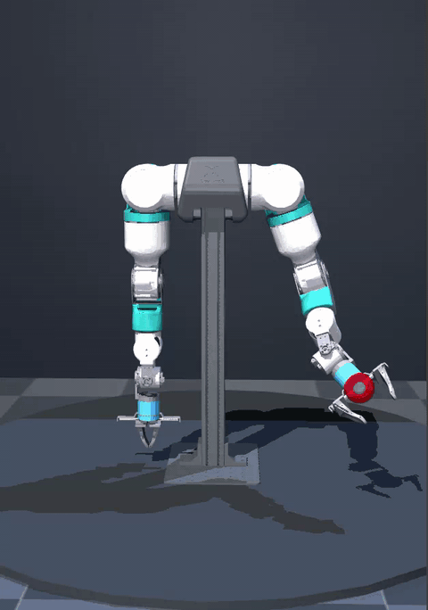

# OpenFlex MuJoCo V2 English Guide

This project is a local **MuJoCo** simulation workspace for the OpenFlex v10 dual-arm robot. The goal is to migrate the OpenFlex visual result from ROS2 / RViz to MuJoCo as completely as possible, and provide dual-arm control, independent left/right gripper control, and a left-arm IK example on top of that.

The model has already been exported to URDF, and the required mesh resources have been organized.

## Preview

The GIF below shows the current OpenFlex MuJoCo V2 scene, including the dual-arm model, control panel, and gripper interaction:

<p align="center">
  
</p>

---

## 🎯 1. Project Goals

This project mainly addresses the following:

- Migrate ROS2 / xacro / URDF models into a MuJoCo-loadable model
- Preserve the ROS2 visual mesh appearance of the OpenFlex v10 dual-arm robot
- Automatically resolve ROS paths like `package://openarmx_description/...`
- Convert, split, and organize `.dae` visual meshes into local directories
- Handle negative scaling in mirrored left/right arm models
- Explicitly write material colors for MuJoCo to better restore robot appearance
- Generate MuJoCo runtime XML and display scene XML
- Provide a dual-arm control scene with draggable joint sliders
- Provide independent open/close control for left and right grippers
- Provide a left-arm IK scene for dragging target points and observing IK behavior

---

## 🚀 2. Quick Start

<span style="color:#d9534f;"><strong>Critical:</strong> finish environment checks first, then run control or IK scenes to significantly reduce debugging time.</span>

This project uses [uv](https://docs.astral.sh/uv/) to manage its Python environment. Create the environment and install dependencies first:

```bash
uv sync
```

Run any script through `uv run`, for example:

```bash
uv run python3 -c "import mujoco, mujoco.viewer, numpy, trimesh; print('MuJoCo environment OK')"
```

> Requires `uv` (install with `pip install uv` or see the official docs). The `pyproject.toml` pins the same dependency versions as the old `requirements.txt`.

Environment self-check:

```bash
python3 -c "import mujoco, mujoco.viewer, numpy, trimesh; print('MuJoCo environment OK')"
```

View the ROS2 visual version model:

```bash
python3 view_ros2_visual_meshes.py
```

Run the dual-arm control scene:

```bash
python3 control.py
```

Run the left-arm IK scene:

```bash
python3 ik.py
```

Only check whether models can be generated and loaded (without opening a window):

```bash
python3 control.py --check
python3 ik.py --check
```

---

## 📦 3. Recommended Dependencies

Python 3.10+ is recommended, with the following core dependencies:

- `mujoco`
- `numpy`
- `trimesh`
- `pycollada`
- `networkx`
- `scipy`
- `glfw`
- `PyOpenGL`

Install example:

```bash
uv sync
```

Or, if you still prefer a plain pip install (e.g. in an existing conda/venv), you can use the original `requirements.txt`:

```bash
python3 -m pip install -r requirements.txt -i https://pypi.tuna.tsinghua.edu.cn/simple
```

<span style="color:#f0ad4e;"><strong>Tip:</strong> if `.dae` conversion fails, first check the mesh-conversion dependency chain.</span>

If `.dae` conversion fails, this check is usually important:

```bash
python3 -c "import trimesh, collada, networkx, scipy; print('mesh conversion deps OK')"
```

---

## 🗂️ 4. Project Structure

Current main file structure:

```bash
.
├── README_CN.md
├── README.md
├── control.py
├── ik.py
├── view_ros2_visual_meshes.py
├── generate_mujoco_fixed_previous.py
├── openflex_robot.urdf
├── openflex_v10_bimanual.urdf
├── openflex_ros2_visual_mujoco.urdf
├── openflex_mujoco_fixed.urdf
├── openflex_control_runtime.xml
├── openflex_control_scene.xml
├── openflex_ik_runtime.xml
├── openflex_ik_scene.xml
├── meshes/
├── mujoco_meshes/
└── ros2_visual_meshes/
```

### 🔑 Key Directories

#### `meshes/`

Original mesh assets copied from ROS2 `openarmx_description`, including:

- `meshes/body/`
- `meshes/arm/`
- `meshes/ee/`

Visual assets are mainly `.dae`, while collision assets are mainly `.stl`.

#### `ros2_visual_meshes/`

MuJoCo visual mesh directory generated by `view_ros2_visual_meshes.py`.

This is the most important visual asset directory in the current V2 version. The script splits, converts, and organizes ROS2 `.dae` visual meshes into this directory while preserving material color information.

#### `mujoco_meshes/`

A centralized mesh directory produced by early compatibility versions, mainly for old `openflex_mujoco_fixed.urdf` or historical scripts. For the closest ROS2 visual result, prioritize `ros2_visual_meshes/`.

---

## 📘 5. Core File Description

### `openflex_robot.urdf`

Main URDF input file of the current project.

It comes from the exported OpenFlex v10 bimanual xacro result and includes dual arms, body, and left/right gripper structure.

### `openflex_v10_bimanual.urdf`

Preserved v10 dual-arm exported URDF. This file records the original structure corresponding to ROS2 launch, for tracing and comparison.

### `openflex_ros2_visual_mujoco.urdf`

MuJoCo-specific visual URDF generated by `view_ros2_visual_meshes.py`.

Features:

- Prefer ROS2 visual meshes
- Remove collision geometry to avoid display and loading interference
- Convert `package://` paths to local paths
- Split / convert `.dae` into meshes easier for MuJoCo to load
- Write ROS2 color information into URDF material
- Bake negative scaling into meshes to avoid mirrored display issues in MuJoCo

### `openflex_control_runtime.xml`

MuJoCo XML generated at runtime by `control.py`.

Features:

- Includes dual-arm and gripper actuators
- Current `nu=18`
  - 14 arm-joint actuators
  - 4 gripper-finger actuators
- Wrist joints 5, 6, 7 have individually increased response speed
- Robot orientation has been rotated to a suitable direction for the current display

### `openflex_control_scene.xml`

Display scene generated by `control.py`.

Includes:

- Checkerboard floor
- Background wall
- Display pedestal
- Studio-style lighting
- Left/right gripper center visualization points

### `openflex_ik_runtime.xml`

MuJoCo XML generated at runtime by `ik.py`, for the left-arm IK scene.

### `openflex_ik_scene.xml`

IK display scene generated by `ik.py`, including target point, gripper center point, and left-arm IK interaction logic.

---

## 🛠️ 6. Core Script Description

### 👀 `view_ros2_visual_meshes.py`

Purpose: generate a MuJoCo visual URDF that is as close as possible to ROS2 / RViz display, and open it in MuJoCo.

Main tasks:

- Read `openflex_robot.urdf`
- Parse `package://openarmx_description/...` paths
- Find and copy ROS2 visual meshes
- Read diffuse colors in `.dae`
- Split internal `.dae` geometry into independent mesh parts
- Convert to local meshes that MuJoCo can load more easily
- Handle negative scaling in mirrored left/right arms
- Remove collision elements to avoid simplified collision geometry affecting visuals
- Write `openflex_ros2_visual_mujoco.urdf`
- Open MuJoCo viewer for preview

Run:

```bash
python3 view_ros2_visual_meshes.py
```

Main outputs:

- `openflex_ros2_visual_mujoco.urdf`
- `ros2_visual_meshes/`

---

### 🎮 `control.py`

Purpose: main scene for dual-arm control and gripper control.

Main tasks:

- Call `view_ros2_visual_meshes.py` to generate ROS2 visual MuJoCo URDF
- Compile URDF into MuJoCo runtime XML
- Write `openflex_control_runtime.xml`
- Write `openflex_control_scene.xml`
- Add position actuators for 14 dual-arm joints
- Add position actuators for 4 finger joints
- Individually increase `kp` and `forcerange` for wrist joints 5, 6, 7
- Build a better-looking display scene
- Support dragging joint sliders in MuJoCo right-side `Control` panel
- Support independent left/right gripper drag control

Run:

```bash
python3 control.py
```

Model check only:

```bash
python3 control.py --check
```

Current control behavior:

- Normal arm joints can be dragged in the MuJoCo right-side `Control` panel
- Two left gripper finger sliders are internally linked
- Two right gripper finger sliders are internally linked
- Dragging any `openarmx_left_finger...` slider only affects the left gripper
- Dragging any `openarmx_right_finger...` slider only affects the right gripper

Shortcuts:

- `O`: open both grippers
- `C`: close both grippers
- `Z`: open left gripper
- `X`: close left gripper
- `N`: open right gripper
- `M`: close right gripper
- `Q`: quit

Current joint-control characteristics:

- Normal arm joints: stability first
- Wrist joints 5, 6, 7: faster response
- Gripper joints: fine opening/closing control via sliders

---

### 🧠 `ik.py`

Purpose: left-arm position IK example.

Main tasks:

- Generate ROS2 visual MuJoCo runtime model
- Build a left-arm IK scene
- Solve position IK using damped least squares
- Control end-effector target position with a red mocap target sphere
- Show gripper center position with a cyan point
- Support left-gripper opening/closing
- Support pause, reset, and debug output

Run:

```bash
python3 ik.py
```

Model check only:

```bash
python3 ik.py --check
```

Operations:

- Drag red target sphere with mouse: change left-arm end target position
- `O`: open left gripper
- `C`: close left gripper
- `R`: reset
- `P`: pause / resume IK
- `D`: enable / disable debug output
- `Q`: quit

---

---

## ✅ 7. Recommended Workflow

<span style="color:#0275d8;"><strong>Recommendation:</strong> strictly follow steps 1→5 to avoid most model and control issues.</span>

### 1️⃣ Step 1: Check Dependencies

```bash
python3 -c "import mujoco, mujoco.viewer, numpy, trimesh; print('OK')"
```

### 2️⃣ Step 2: Confirm ROS2 Visual Model Can Be Generated

```bash
python3 view_ros2_visual_meshes.py
```

If the model opens correctly, visual meshes, materials, and paths are basically available.

### 3️⃣ Step 3: Check Control Model

```bash
python3 control.py --check
```

Normally, you should see something like:

```text
position actuator 数量: 18
nq=18 nv=18 nu=18 nbody=22 ngeom=52
```

### 4️⃣ Step 4: Run Dual-Arm Control Scene

```bash
python3 control.py
```

Key checks:

- Whether dual-arm joints can be dragged in the right-side `Control` panel
- Whether joints 5, 6, 7 respond fast enough
- Whether left and right grippers can be dragged independently
- Whether `Z/X/N/M/O/C` shortcuts work correctly

### 5️⃣ Step 5: Run IK Scene

```bash
python3 ik.py
```

Key checks:

- Whether the red target sphere can be dragged
- Whether the left-arm end effector follows the target sphere
- Whether the left gripper can open/close
- Whether scene orientation and visuals meet the current display requirement

---

## ⚠️ 8. FAQ

### ❗ 1. MuJoCo Cannot Find Mesh Files

Common causes:

- Script is not run from project root
- `meshes/` or `ros2_visual_meshes/` is incomplete
- URDF still contains unconverted `package://` paths

Recommended first command:

```bash
cd /home/y/Desktop/openarmx_mojuco_v2
python3 view_ros2_visual_meshes.py
```

### 🎨 2. Colors Do Not Match ROS2 / RViz

Current V2 already tries to read diffuse colors from `.dae` and write MuJoCo-usable materials.

If differences remain, common causes include:

- Complex material hierarchy inside `.dae`
- Different lighting models between MuJoCo and RViz
- Incomplete material mapping after mesh splitting
- Scene lighting and reflections affecting final perception

Check first:

- `view_ros2_visual_meshes.py`
- `ros2_visual_meshes/`
- `openflex_ros2_visual_mujoco.urdf`

### 🪞 3. Mirrored Left/Right Arm Direction Is Abnormal

In ROS2 URDF, left-arm visual mesh may contain negative scaling such as `scale="1.0 -1.0 1.0"`.

MuJoCo handling of negative scaling and mesh normals may differ from RViz. This project handles it by:

- Not directly keeping negative scaling
- Baking mirror transforms into exported meshes
- Loading with positive scaling in URDF

Related logic is mainly in:

```text
view_ros2_visual_meshes.py
```

### 🤏 4. Gripper Cannot Close or Cannot Be Dragged

Please make sure you are using runtime generated by current `control.py`, not old XML.

Run:

```bash
python3 control.py --check
```

Normally you should see:

```text
position actuator 数量: 18
nu=18
```

If it is only `nu=14`, gripper actuators were not added; re-run the current `control.py`.

### 🐢 5. Joints 5, 6, 7 Move Slowly

Current `control.py` already speeds up wrist joints 5, 6, 7:

- `WRIST_SERVO_KP = 900`
- `WRIST_ACTUATOR_FORCE = 45`

If still too slow, you can continue tuning these two parameters, but too high values may cause jitter or instability.

### 🧭 6. Model Orientation Is Wrong in Viewer

Robot overall orientation is handled by a yaw root body in `control.py` and `ik.py`.

Current related parameter in `control.py`:

```python
ROBOT_YAW_LEFT_90 = "-1.57079632679"
```

If you need further front-direction adjustment, prioritize changing this value rather than only changing camera view.

---

## 📁 9. Generated Outputs

<span style="color:#5cb85c;"><strong>Sync Reminder:</strong> after modifying URDF / mesh / parameters, rerun corresponding scripts to refresh generated outputs and avoid old artifacts interfering.</span>

Common generated files and usage:

- `openflex_ros2_visual_mujoco.urdf`: MuJoCo URDF converted from ROS2 visual meshes
- `ros2_visual_meshes/`: visual mesh directory after splitting, conversion, and mirror handling
- `openflex_control_runtime.xml`: dual-arm control runtime XML
- `openflex_control_scene.xml`: dual-arm control display scene
- `openflex_ik_runtime.xml`: IK runtime XML
- `openflex_ik_scene.xml`: IK display scene
- `MUJOCO_LOG.TXT`: MuJoCo runtime log

If you modify URDF, mesh, materials, joint parameters, or control logic, it is recommended to rerun corresponding scripts to refresh outputs.

---

## 👤 Author

- **Yao Wenhao** (姚文昊)
- Company: Chengdu Changshu Robot Co., Ltd.
- Website: https://openarmx.com/

## 🏷️ Version

v1.0.0

## 📜 License

This work is licensed under the Creative Commons Attribution-NonCommercial-ShareAlike 4.0 International License (CC BY-NC-SA 4.0).

Copyright (c) 2026 Chengdu Changshu Robot Co., Ltd.

For details, see [LICENSE_CN.md](LICENSE) or visit: http://creativecommons.org/licenses/by-nc-sa/4.0/

---

## 📞 Contact Us

### Chengdu Changshu Robotics Co., Ltd.
**Chengdu Changshu Robotics Co., Ltd.**

| Contact | Info |
|---------|------|
| 📧 Email | openarmrobot@gmail.com |
| 📱 Phone/WeChat | +86-17746530375 |
| 🌐 Website | <https://openarmx.com/> |
| 📍 Address | Huacheng Machinery Factory, No.11 Xinye 8th Street, West Area, Tianjin Economic-Technological Development Area |
| 👤 Contact Person | Mr. Wang |
