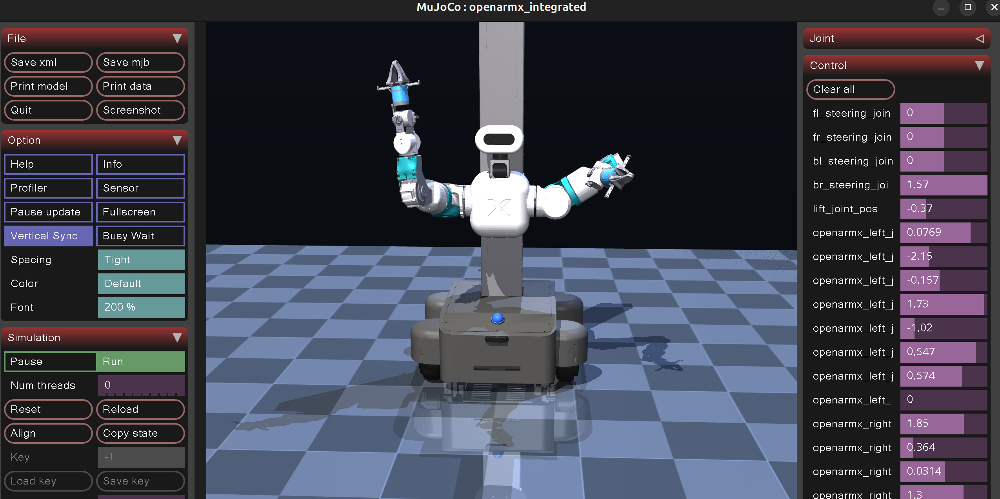

[📗 English](README.md)

# OpenFlex MuJoCo 中文说明

本项目把原本用于 **ROS2 / RViz** 的 OpenFlex v10 **完整全身模型**（移动底盘 + 升降 +
双臂 + 头部）转换成可直接用 **最普通的 MuJoCo viewer** 打开的成品 MJCF，并在此基础上提供
双臂 / 头部 / 升降控制与夹爪联动。

核心思路：把「URDF → MuJoCo 编译 + 注入 actuator / 夹爪联动」这一步**一次性固化**成一个自包含成品 XML，
viewer 只负责加载显示，不再依赖任何运行时中间文件。

---

## 🖼️ 效果图



---

## 🎯 1. 项目目标

- 把 ROS2 / xacro / URDF 完整全身模型迁移到 MuJoCo 可加载模型
- 自动处理 `package://<pkg>/...` 这类 ROS 路径（自动映射到本地 `packages/<pkg>/`，支持多 package）
- 把所有视觉网格（`.dae` / `.stl`，含 ASCII STL）经 trimesh 转成 `.obj` 并收敛到 `mujoco_meshes/`
- 剥离 MuJoCo 不识别的 `<ros2_control>` 标签
- 给缺失 `<inertial>` 的运动连杆补默认惯量（如头部 pitch/yaw 连杆）
- 把 URDF 的 `<mimic>`（被 MuJoCo 编译时丢弃）用 `<equality>` 约束补回，实现夹爪联动
- 生成一个自包含的成品 XML，可用任意 MuJoCo viewer 直接打开
- 提供原生 viewer（拖滑块控制关节，重力默认关闭以保证静止）

---

## 🚀 2. 快速开始

本项目用 [uv](https://docs.astral.sh/uv/) 管理环境（也兼容普通 pip）：

```bash
uv sync
# 或： python3 -m pip install -r requirements.txt
```

环境自检：

```bash
python3 -c "import mujoco, mujoco.viewer, numpy, trimesh; print('MuJoCo environment OK')"
```

### 获取仓库与运行

本仓库**已提交** `openflex_mujoco.xml` 与 `mujoco_meshes/`，因此克隆后**无需运行 `convert.py`**
就能直接用 viewer 看模型：

```bash
# 普通克隆即可直接查看（推荐，最简单）
git clone <本仓库地址> openflex_mujoco
cd openflex_mujoco
python3 viewer.py            # 直接打开已生成的成品模型
```

若想用 **OpenFleX 上游最新模型**重新构建（而不是用仓库里已提交的成品），
需要**递归克隆**以拉取 `packages/` 下的 4 个 git 子模块，再重跑转换：

```bash
# 递归克隆：额外拉取 packages/ 的 4 个子模块（描述文件来自 OpenFleX-Wheeled-Humanoid org）
git clone --recursive <本仓库地址> openflex_mujoco
cd openflex_mujoco

# 仅拉取子模块（已克隆过主仓库、忘了 --recursive 时）：
git submodule update --init --recursive

# 用最新上游模型重新生成 openflex_mujoco.xml + mujoco_meshes/
python3 convert.py
python3 viewer.py
```

> 注意：未递归克隆时 `packages/` 为空，`convert.py` 会因找不到源网格而失败；
> 此时直接用仓库已提交的成品 XML + viewer 即可（见上面的「普通克隆」）。

只校验生成 / 加载、不打开窗口：

```bash
python3 convert.py --check
python3 viewer.py  --check
```

---

## 💥 5. 两个碰撞版本

仓库提供两种成品模型，区别在于**机器人自身零部件之间是否互相碰撞**：

| 版本 | 文件 | 说明 | 启动方式 |
|---|---|---|---|
| A. 仅地面碰撞（默认） | `openflex_mujoco.xml` | 机器人只与地板 / 外部物体碰撞，**连杆之间不自碰**（避免相邻视觉网格重叠抖炸） | `python3 viewer.py` |
| B. 全面自碰撞 | `openflex_mujoco_selfcol.xml` | 双臂 / 升降 / 机身 / 底盘之间全部互相碰撞（视觉网格直接开启碰撞，零冗余） | `python3 viewer.py --self-collision` |

版本 B 的实现要点（已优化，无冗余）：
- **直接让视觉网格 geom 本身参与碰撞**：MuJoCo 的 mesh geom 本来就同时负责渲染与碰撞，
  `contype/conaffinity` 只决定「碰不碰」。所以只需把视觉网格的碰撞分组从 `2/1`（只碰地板）
  改为 `3/3`（与一切碰撞），每个 link 一个 geom 同时渲染 + 碰撞，**无需再生成一套重叠的碰撞网格**。
- 因为底盘大平台（base_link 视觉网格）也随之一起碰撞，手臂压到机身/底盘上会被挡住。
- 相邻关节的父子 body 之间加 `<exclude>`，避免关节处几何重叠导致的抖炸；
  另外排除**所有「非机械臂刚体之间」的互碰**（底盘 / 轮子 / 升降柱 / 机身 / 头部本是一体或
  安装重叠，互相碰撞会被求解器顶飞、导致升降启动后失控上升），保留**所有含机械臂的碰撞**：
  臂 ↔ 臂、臂 ↔ 机身 / 底盘、臂 ↔ 升降柱、臂 ↔ 头部。即机身仍保有碰撞体积（手臂能撞到它），
  只是机身各部件之间不互碰。
- `convert.py` 默认会**同时生成两个版本**。

> 想用版本 B 时，克隆后直接 `python3 viewer.py --self-collision` 即可（成品已提交）；
> 若想用 OpenFleX 最新模型重建，需先 `git submodule update --init --recursive`。

---

## 📦 3. 依赖

- `mujoco`、`trimesh`、`pycollada`（见 `requirements.txt` / `pyproject.toml`）
- 若 `.dae` 转换失败，检查网格转换链：
  ```bash
  python3 -c "import trimesh, collada; print('mesh conversion deps OK')"
  ```

---

## 🗂️ 4. 项目结构

```bash
.
├── README_CN.md
├── README.md
├── convert.py                       # 转换程序：URDF -> 自包含成品 MJCF
├── viewer.py                        # 原生 MuJoCo viewer（加载成品 XML）
├── openflex_integrated_robot.urdf   # 源：ROS2 导出的完整全身 URDF
├── packages/                        # 源：4 个 git 子模块（OpenFleX 上游描述文件，不进主仓库历史）
│   ├── openflex_chassis/            #   -> base_model_interface_layer（含 swerve_description）
│   ├── lift_slide_description/      #   -> OpenFleX-Wheeled-Humanoid/lift_slide_description
│   ├── openarmx_description/        #   -> OpenFleX-Wheeled-Humanoid/openarmx_description
│   └── openarmx_head_description/   #   -> OpenFleX-Wheeled-Humanoid/openarmx_head_description
├── openflex_mujoco.xml              # 成品(已提交)：自包含成品 MJCF（含 actuator/联动/地板/灯光）
└── mujoco_meshes/                   # 成品(已提交)：转换后的 MuJoCo 友好网格（.obj，相对路径引用）
```

> `openflex_mujoco.xml` 与 `mujoco_meshes/` **已提交到仓库**，克隆即直接用 viewer 打开，无需重跑 `convert.py`；
> 仅当你想用 OpenFleX 上游最新模型重建时才需要 `git clone --recursive` 拉取 `packages/` 子模块并重跑 `convert.py`。
> 源描述文件（`packages/`）以 **git 子模块**方式引用（来自 `https://github.com/orgs/OpenFleX-Wheeled-Humanoid/repositories`），
> 不进入本仓库历史，因此主仓库保持精简。

---

## 📘 5. 核心文件说明

### `openflex_integrated_robot.urdf`

ROS2 导出的完整全身 URDF（底盘 + 升降 + 双臂 + 头部），是整个工程的输入。它引用了多个
`package://<pkg>/` 前缀的网格，转换时由 `convert.py` 自动映射到本地 `packages/<pkg>/`。
其中夹爪用 `<mimic>` 描述联动，但 MuJoCo 的 URDF 导入器会**静默丢弃**该标签，所以联动在
转换时单独补回。

### `convert.py`

转换程序，只负责「编译 + 注入」，不涉及显示：

1. 剥离 `<ros2_control>`；URDF 的 `<collision>` 标签被丢弃，改用视觉网格同时作为碰撞几何
   （开启与地板 / 外物的碰撞，关闭连杆间自碰撞，避免相邻视觉网格重叠导致抖炸）、给缺失惯量的运动连杆补默认惯量
2. 把每个 visual 网格（`.dae` / 任意 `.stl` 含 ASCII）经 trimesh 转成 `.obj`（保留颜色、负缩放烘焙进网格）
3. 编译成 MuJoCo 模型，序列化为 MJCF
4. 合并地板 + studio 风格灯光
5. 把机器人整体包进一个 `yaw root` body（绕 Z 轴旋转到正对默认视角）
6. 注入 `<equality>` 夹爪联动：每个 `finger_joint2` 跟随对应 `finger_joint1`
7. 注入 position actuator：**`nu=23`**（14 臂关节 + 2 主手指 + 2 头部 + 1 升降 + 4 转向；
   连续轮关节不加 actuator，仅靠阻尼稳定；`finger_joint2` 由 equality 约束驱动）。
   每个 actuator 同时带微分增益 `kv`（即 kd 阻尼），消除振荡、让关节可控。升降 `kp` 取 10000
   以扛住约 253N 的上半身重力（重力下稳态下垂约 2.5cm），`kv` 取 2000（≈2×临界阻尼、过阻尼），
   移动到位后几乎无振荡、约 0.7s 稳定，不会「滑落」也不会长时间抖动
8. 网格路径统一收敛到 `mujoco_meshes/`，写成相对路径，成品 XML 可直接拷贝分发
9. 机器人整体上抬，使几何最低点（车轮）恰好落在地板面（`z=0`），不会陷入地下

产物 `openflex_mujoco.xml` 是**自包含**的，可被 `python -m mujoco.viewer openflex_mujoco.xml`
这类最普通的 MuJoCo viewer 直接打开。

### `viewer.py`

原生 viewer。直接 `mujoco.MjModel.from_xml_path(openflex_mujoco.xml)` +
`mujoco.viewer.launch(model, data)`，右侧面板拖滑块即可控制关节，鼠标拖拽旋转 / 缩放。

---

## 🤏 6. 夹爪联动设计

URDF 中每个夹爪有两个 prismatic 手指关节：

- `finger_joint1`：axis `0 -1 0`，range `0 0.044`
- `finger_joint2`：axis `0  1 0`，range `0 0.044`，并 `<mimic joint="finger_joint1"/>`

MuJoCo 导入 URDF 时丢弃 `<mimic>`，于是两个手指完全独立。`convert.py` 用
`<equality><joint joint1="finger_joint1" joint2="finger_joint2"/>` 约束
（默认 `q_joint2 = q_joint1`）。由于两关节 axis 符号相反、`q` 相等即产生对称的镜像开合，
且都在 `0 0.044` 合法范围内，不会出范围冲突。

控制界面每边只暴露一个滑块（`finger_joint1`），`finger_joint2` 由约束自动跟随。

---

## ⚠️ 7. 常见问题

### 1. MuJoCo 找不到 mesh 文件

- 必须在项目根目录运行脚本
- `meshes/`（源）或 `mujoco_meshes/`（产物）不完整时，重新运行 `python3 convert.py`
- URDF 中若仍有 `package://` 路径未转换，说明 convert 没跑成功

### 2. 夹爪不能闭合 / 不能拖动

确认用的是 `convert.py` 生成的 `openflex_mujoco.xml`，而不是旧 XML：

```bash
python3 convert.py --check
```

正常应看到 `nu=23`（14 臂 + 2 主手指 + 2 头部 + 1 升降 + 4 转向）。若数量不对，说明 actuator 没注入完整，重跑 `convert.py`。

### 3. 模型在窗口里朝向不对

机器人整体朝向由 `convert.py` 里的 `ROBOT_YAW`（`-1.57079632679`，即绕 Z 轴 -90°）控制。
调整它即可改变机器人正面方向，而不只是改相机视角。

---

## 📁 8. 运行产物

- `openflex_mujoco.xml`：自包含成品 MJCF（含 actuator / 夹爪联动 / 地板 / 灯光）
- `mujoco_meshes/`：转换后的 MuJoCo 友好网格目录（相对路径被成品 XML 引用）

修改 URDF / mesh / 参数后，重新运行 `python3 convert.py` 刷新这两个产物即可。
